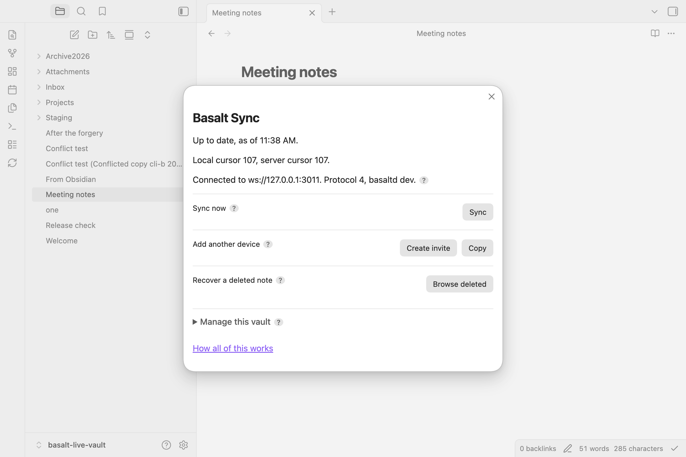
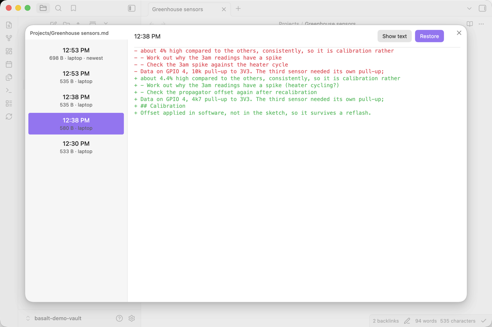
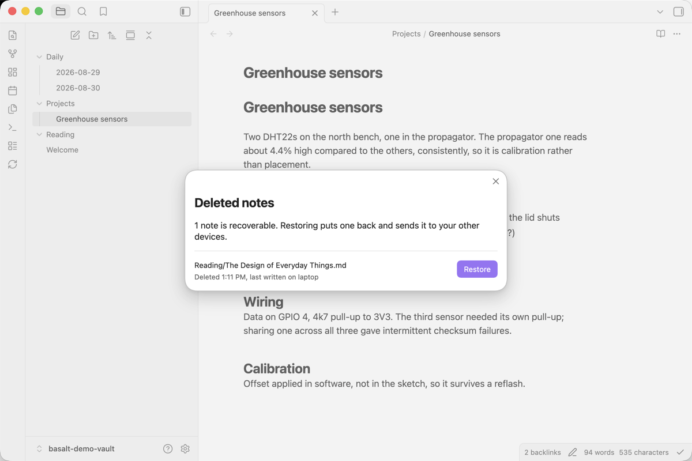
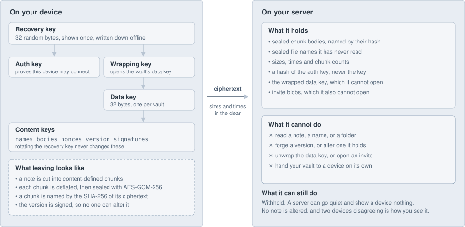
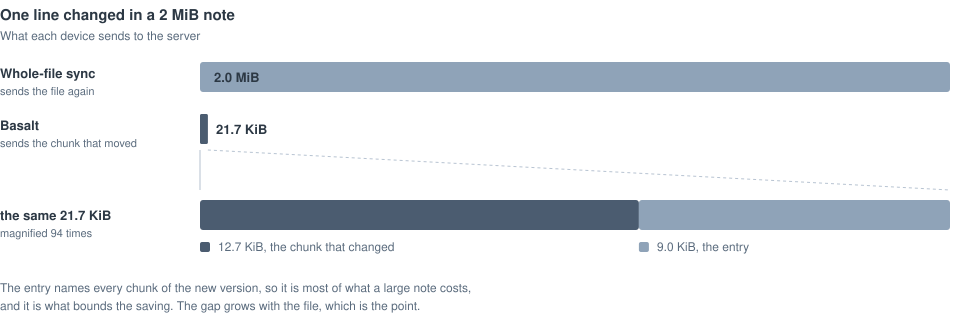

#  Basalt Sync

Basalt Sync is self-hosted sync for Obsidian. It keeps a vault the same on every device you own, through one small server you run yourself. Notes and file names are encrypted before they leave a device, only the part of a note that changed crosses the wire, and a conflict keeps both versions rather than guessing.

[](https://github.com/waynehoover/basalt-sync/actions/workflows/ci.yml)
[](LICENSE)
[](server/go.mod)
[](https://www.npmjs.com/package/basalt-sync)

<a href="#self-hosting">Self-host instructions</a> | <a href="docs/server.md">Server</a> | <a href="docs/plugin.md">Plugin</a> | <a href="docs/protocol.md">Protocol</a> | <a href="docs/compared.md">How it compares</a>

## About

Obsidian Sync works well and costs a subscription. The self-hosted alternatives are good and general, which means they carry backends, options and settings screens that a person syncing their own notes between their own devices does not need.

Basalt is the narrow version. One backend, one transport, one person's devices. Every question with a right answer is answered once in the source instead of becoming a setting, which is why there is no settings screen and why the whole interface is one panel. The rule it will not break is that a note is never lost: when simplicity and correctness disagree, the feature gets cut.

## Screenshots

<table>
  <tr>
    <th align="center">The panel, which is all of the interface</th>
    <th align="center">Version history, with a diff against disk</th>
  </tr>
  <tr>
    <td align="center">
      <picture>
        <source media="(prefers-color-scheme: dark)" srcset="docs/assets/screenshots/panel-dark.png">
        
      </picture>
    </td>
    <td align="center">
      <picture>
        <source media="(prefers-color-scheme: dark)" srcset="docs/assets/screenshots/changes-dark.png">
        
      </picture>
    </td>
  </tr>
  <tr>
    <th align="center">Deleted notes, kept until you purge</th>
    <th align="center">Adding a device</th>
  </tr>
  <tr>
    <td align="center">
      <picture>
        <source media="(prefers-color-scheme: dark)" srcset="docs/assets/screenshots/recover-dark.png">
        
      </picture>
    </td>
    <td align="center">
      <picture>
        <source media="(prefers-color-scheme: dark)" srcset="docs/assets/screenshots/pairing-dark.png">
        
      </picture>
    </td>
  </tr>
</table>

## Self-hosting

> [!NOTE]
> **Requirements:** any always-on machine that runs Docker or a single binary. Linux or macOS, amd64 or arm64. No database, no message broker, no accounts. The image is 12 MB, and the data directory is one folder you can copy.

**1. Run the server.**

```bash
docker run -d --name basalt -p 127.0.0.1:3003:3003 \
  -v basalt-data:/data ghcr.io/waynehoover/basalt-sync:latest
docker logs basalt
```

The log prints one line for your first device, `host:3003#TOKEN`. The server speaks plain HTTP on purpose, so that no key material lives in it. Put TLS in front before anything else can reach it: `tailscale serve --bg 3003` is one line, and [docs/server.md](docs/server.md) covers Compose, systemd, Caddy and every flag.

**2. Install the plugin.** Put `main.js`, `manifest.json` and `styles.css` from the [latest release](https://github.com/waynehoover/basalt-sync/releases/latest) into `<vault>/.obsidian/plugins/basalt-sync/`, then enable Basalt Sync under Community plugins.

**3. Start the vault.** Click the Basalt icon and paste that line under **Start a new vault**. It shows the vault's recovery key once. Write it down and keep it offline: it is the only way back if every device is lost, and anyone holding it has the vault.

**4. Add your other devices.** On a device that already has the vault, press **Add another device**, then paste the invite it gives you into Basalt on the new one. An invite works once, expires in ten minutes, and carries no secret the server can read.

### Without Obsidian

The same engine with the filesystem in place of Obsidian's API, for a NAS or a server.

```bash
npm install -g basalt-sync
basalt init 'homelab:3003#K7M2...'   # the first device, from the server log
basalt invite                        # on a device that has the vault
basalt pair basalt3i_...             # on the new device
basalt sync --watch
```

## Documentation

| | |
|---|---|
| [Server](docs/server.md) | Install, TLS, backup and restore, purge, rotation, every command and flag |
| [Plugin](docs/plugin.md) | Pairing, status, history, conflicts, what is not synced, phones |
| [Headless client](client/README.md) | The `basalt` command, and how the client is built and tested |
| [How it compares](docs/compared.md) | Against Obsidian Sync, Sync Engine and Fast Note Sync, with the measurements |
| [Design](docs/design.md) | The durability rules, what is refused on purpose, and the threat model |
| [Protocol](docs/protocol.md) | The wire protocol |

## Security architecture

<picture>
  <source media="(prefers-color-scheme: dark)" srcset="docs/assets/security-dark.svg">
  
</picture>

- **The server never holds a key.** Note contents and file names are sealed on the device. What it stores is ciphertext, and what it can tell about that ciphertext is its length and that two chunks are identical, which is what deduplication is made of.
- **It cannot write either.** Every version carries a signature under a key the server has never seen, so it cannot forge a version, alter one, or move one file's contents onto another.
- **A leaked recovery key can be retired.** Content is sealed under a data key that the recovery key only wraps, so `basalt rotate` gives the vault a new secret and keeps every version of the history.
- **What it can still do is withhold.** A server can go quiet and show a device nothing. No note is altered, and two devices disagreeing is how a person notices. That is stated rather than solved, and [the design doc](docs/design.md) says why the alternative was rejected.

## What makes it fast

<picture>
  <source media="(prefers-color-scheme: dark)" srcset="docs/assets/wire-dark.svg">
  
</picture>

Notes are cut into content-defined chunks, so an edit sends the chunk that moved rather than the file. Chunks are compressed before they are encrypted, which takes a vault's text from 108% of plaintext on the wire down to about 60%. Two thousand files reach a second device in tens of round trips rather than thousands, and a pass over a vault where nothing changed is too fast to measure. Every number here was measured, including a run against a real 3,751-file vault, and [docs/compared.md](docs/compared.md) shows them.

## Features and roadmap

- [x] End-to-end encrypted note contents and file names
- [x] Only the chunk that changed crosses the wire
- [x] Conflicts keep both versions, and never rewrite the file you have open
- [x] Full version history and deleted-note recovery, inside Obsidian
- [x] Single-use invites to add a device, with the recovery key kept offline
- [x] Rotate a leaked recovery key without losing history
- [x] Headless client for a machine with no Obsidian
- [x] One static binary, verified atomic backups, and a restore runbook
- [ ] Tested on iOS, which should work and has never been run
- [ ] Listed in the Obsidian community directory
- [ ] Syncing themes and snippets, the one open question in [the design](docs/design.md)

Desktop and Android are in daily use.

## License

MIT. See [LICENSE](LICENSE).
