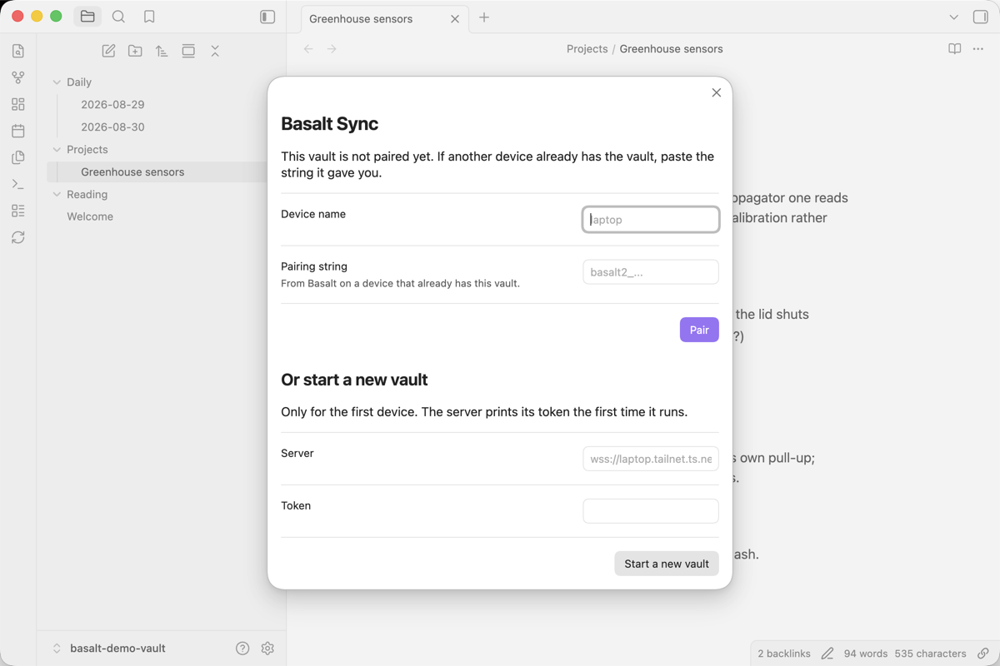
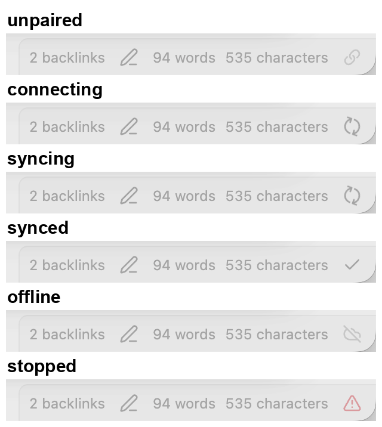
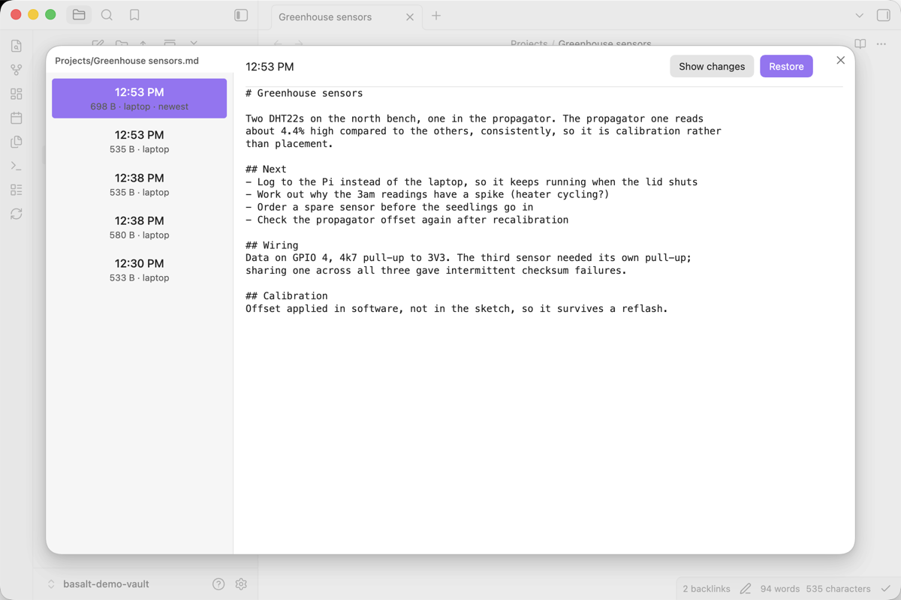

# The plugin

[Back to the README](../README.md)

Basalt Sync runs inside Obsidian on desktop and mobile. It needs Obsidian 1.7.2
or newer. It has no settings tab: one panel, opened from the ribbon icon, that
pairs a vault and says what is happening.

## Install

Not yet in the community directory. Put `main.js`, `manifest.json` and
`styles.css` from the [latest release](https://github.com/waynehoover/basalt-sync/releases/latest)
into `<vault>/.obsidian/plugins/basalt-sync/`, then enable Basalt Sync under
Community plugins.

Every release asset is rebuilt in CI and attested. To check one:

```bash
gh attestation verify main.js --repo waynehoover/basalt-sync
```

## Pairing

Click the Basalt icon in the ribbon, or run **Basalt Sync: Show status**.

<picture>
  <source media="(prefers-color-scheme: dark)" srcset="assets/screenshots/pairing-dark.png">
  
</picture>

**The first device** pastes the line the server printed on its first run into
*Setup string*, under *Start a new vault*. It looks like
`192.168.1.20:3003#K7M2PQR4-...`. If TLS is in front, put that hostname before
the `#` instead: `wss://homelab.tailnet.ts.net#K7M2PQR4-...`. The plugin
generates the vault's root secret, claims the vault, and shows the recovery key
once, under *Write this down*. Write it down and keep it offline: it is the
whole vault, past and future, and the server has never seen it and cannot
reissue it. Adding a device does not need it.

**Every other device** is added with an invite. On a device that has the vault,
press *Add another device*, then *Create invite*; the panel shows a
`basalt3i_` string and when it expires, ten minutes later. Paste it into
*Invite or recovery key* on the new device and press *Pair*. An invite works
once and carries no secret of its own: the new device uses it to fetch the
vault's key from the server, sealed under a key that stays inside the invite
string. The recovery key pastes into the same field, for a vault whose every
device is lost.

*Show recovery key* sits behind a warning in the panel and is not the way to
add a device. *Pair* with an invite saves the key the server hands over before
it connects, because the invite is spent the moment it is redeemed. *Pair* with
a recovery key reaches the server before it saves anything, so a mistyped
string is refused on the spot. *Start a new vault* saves first, because that
handshake is what claims the vault and the secret has to be on disk before the
server binds to it; if the server then refuses, the notice says so and offers
unlink.

The device name is optional. Left blank it becomes `obsidian-` and four random
characters, so two devices left at the default do not share a name. It appears
in version history and in conflict copy filenames.

The pairing is stored in the plugin's own `data.json`, with the root secret in
the clear. That is inherent: the device has to decrypt the vault without
asking anyone. It is the same exposure as any password manager's local store.

## What it does

The plugin syncs when you change something, after a 400 ms pause, and does a
full pass every 30 seconds. A quiet vault costs about a millisecond per pass
because Obsidian already keeps the file list in memory. When the connection
drops it reconnects with backoff and picks up where it left off. A server that
says it is busy, because the vault has eight devices connected or because it is
shutting down, is treated the same way: offline, then a retry after the wait
the server suggested. Only a refusal that would repeat word for word stops it.

The panel shows the local cursor and the server cursor. A device that is behind
and stays behind while nothing arrives is the one thing the protocol cannot
detect on its own, and these two numbers are how you see it.

The status bar icon shows the state. Obsidian mobile has no status bar, so the
same sentence is the ribbon icon's tooltip.

<picture>
  <source media="(prefers-color-scheme: dark)" srcset="assets/screenshots/status-states-dark.png">
  
</picture>

| | |
|---|---|
| unpaired | open the panel to pair |
| connecting, syncing | working |
| synced | up to date, with the time of the last pass |
| synced, needs attention | up to date except for files that need a person: a name that is a file here and a folder elsewhere, or a file the server refused. The panel names them. |
| failed | the last pass did not finish, with the reason; it will try again |
| offline | cannot reach the server, retrying |
| stopped | a refusal that retrying would not fix, see below |

**Stopped** means the server refused this device in a way that will repeat:
the protocol version differs, the vault is not this device's, or the server has
lost history this device already has. The notice says which. Upgrade the
server and plugin together for the first, and unlink and re-pair for the
others. An unreadable `data.json` also stops the plugin rather than starting
over, because starting over would make everything on the server undecryptable
from here.

## Commands

| Command | |
|---|---|
| Sync now | forces a pass and reports what it did |
| Show status | opens the panel |
| Show version history | for the open note |
| Recover a deleted note | lists what the server has and this vault does not |

Version history is also on a note's right-click menu, where Obsidian Sync puts
it. Both are registered on Obsidian's own command line as `basalt:history` and
`basalt:restore`.

## Version history

The server keeps every version of everything since the first sync. The history
view lists them newest first, shows the text of the one you pick or its
changes against what is on disk, and pages further back twenty at a time.



**Restoring never overwrites.** If the path is occupied, the restored copy is
written beside it as `Note (restored 42).md` and the notice says so. The
restored note keeps its original timestamp and is uploaded like any other
change. The notice separates the two outcomes: "Restored X. Sent to your other
devices." when the upload went through, and otherwise that it is on this device
and will be sent when the next sync succeeds, with the reason.

## Deleted notes

*Recover a deleted note* lists paths whose newest version is a deletion, with
when and on which device, newest first, with *Show older* for more. Restore puts
one back and sends it on. The heading counts what can be restored and what was
purged separately, and a note whose history was purged is listed without a
button, because a list that quietly dropped it would tell you a note was gone
when it was only purged.

A deletion arriving from another device is moved to the system trash, or to
the vault's `.trash` if that fails. Nothing is deleted outright.

## Conflicts

Two devices editing the same note while apart is normal. Basalt merges the two
when the changed regions do not overlap, which covers two devices appending to
one daily note. When they do overlap, or the merge cannot be verified, both
versions are kept:

```
Meeting notes.md
Meeting notes (Conflicted copy laptop 202608311412).md
```

The **incoming** version gets the conflict name. The file you have open is
never rewritten by a sync you did not ask for. Obsidian Sync does it the other
way round.

A note deleted on one device and edited on another is restored, not deleted.

## What is not synced

- `.obsidian`, or whatever your config folder is named. Settings, themes,
  snippets, plugins and workspace do not sync. Obsidian holds that folder in
  memory and writes it back, so a change arriving from elsewhere would be
  silently undone, and the pairing secret lives in there.
  [design.md](design.md) has the full reasoning and what would reopen
  it.
- Any file or folder whose name starts with a dot, at any depth. That covers
  `.basalt`, `.trash`, `.git` and `.DS_Store`, and also things like
  `.gitignore` or `.smart-env/`. Obsidian does not index dot-prefixed paths,
  so the plugin neither uploads them nor accepts them from another device.
- Files larger than the server's limit, 64 MiB by default. The plugin refuses
  them from their size before opening them. `basaltd serve -max-file` raises
  it.

Everything else in the vault syncs, attachments included. Attachments are
supported rather than optimised for; a vault that is mostly video wants a file
sync, not a note sync.

## Phones

There is no background sync on a phone. Basalt runs inside Obsidian and syncs
while Obsidian is open and in the foreground; nothing runs when the app is
closed or the screen is off, and there is no push. Open Obsidian and the vault
catches up.

Android is in daily use. Sync stops when the screen is off because Android
suspends the network, and resumes on its own. A first sync of a large vault
needs the screen on until it finishes.

iOS is untested. The plugin is not marked desktop-only and the bundle contains
nothing Node-specific, so it should run. If a new pairing never manages to
connect, the panel shows this device's origin and the `-allow-origin` flag that
would admit it, and the server logs the same thing; a pairing that has worked
before and is merely offline gets no such advice.

## Durability

Every download is written to a staging file beside the note, read back byte
for byte, and only then put in place. Obsidian's file API offers no way to
flush to disk, so on desktop the plugin uses Electron's own file system to make
a note durable before the index that names it is saved. On a phone there is no
such call, and the ordering is best effort: a power loss in the second between
a note landing and the index being written can leave the two out of step, and
the next pass repairs it from the server. A crash can leave a staging file
named `.basalt-tmp-...` beside a note; it is safe to delete.

## Unlink

*Unlink this vault* waits for the running pass to finish, removes the plugin's
index, then forgets the pairing. Every note stays where it is, here and on the
server. If a step fails the plugin stays paired and says why, and Unlink can be
tried again. Pair again to resume.
